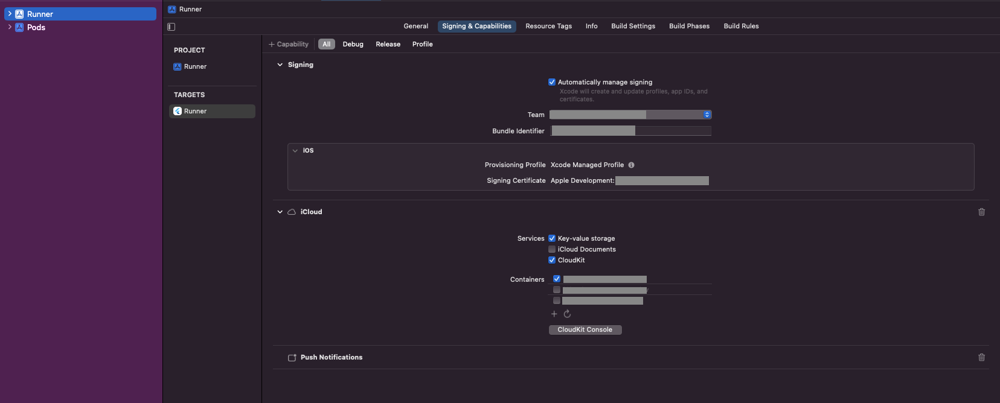

# cloud_helper

Plugin for Flutter that allows uploading, deleting and modifying records to iCloud.

## Prerequisite

The following setups are needed in order to use this plugin:

1. An apple developer account
2. Created an App ID and iCloud Container ID
3. Enabled iCloud capability and assigned iCloud Container ID for the App ID
4. Enabled iCloud capability in Xcode

Refer to the [How to set up iCloud Container and enable the capability](#how-to-set-up-icloud-container-and-enable-the-capability) section for more detailed instructions.

## API Usage

### Get instance

```dart
final cloudHelper = await CloudHelper.create('iCloudContainerId');
```

### Get files from iCloud

```dart
final fileList = await cloudHelper.getAllRecords(type: 'recordType');
```

### Upload a file to iCloud

```dart
await cloudHelper.addRecord(
    data: 'recordData',
    id: 'recordId',
    type: 'recordType',
);
```

### Delete a file from iCloud

```dart
await cloudHelper.deleteRecord(id: recordId,);
```

### Modify a file

```dart
await cloudHelper.editRecord(
    id: 'recordId',
    data: 'newData',
);
```

## How to set up iCloud Container and enable the capability

1. Log in to your apple developer account and select 'Certificates, IDs & Profiles' from the left navigation.
2. Select 'Identifiers' from the 'Certificates, IDs & Profiles' page, create an App ID if you haven't done so, and create an iCloud Containers ID.
   
3. Click on your App ID. In the Capabilities section, select 'iCloud' and assign the iCloud Container created in step 2 to this App ID.
   
4. Open your project in Xcode. Set your App ID as 'Bundle Identifier' if you haven't done so. Click on '+ Capability' button, select iCloud, then tick 'CloudKit' in the Services section and select your iCloud container.
   

## References

[Apple Documentation - iOS Data Storage Guidelines](https://developer.apple.com/icloud/documentation/data-storage/)

[Apple Documentation - Designing for Documents in iCloud](https://developer.apple.com/library/archive/documentation/General/Conceptual/iCloudDesignGuide/Chapters/DesigningForDocumentsIniCloud.html)
